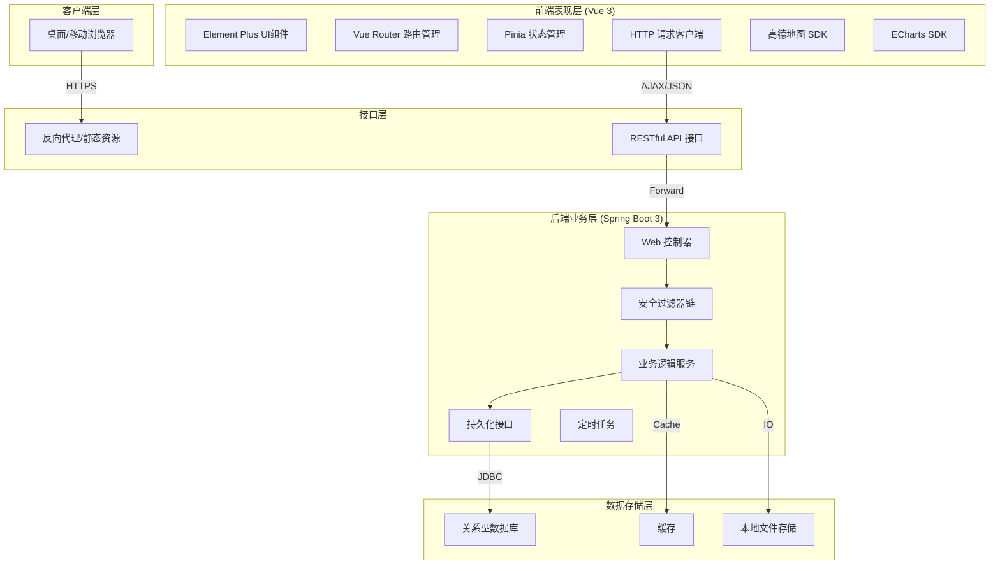
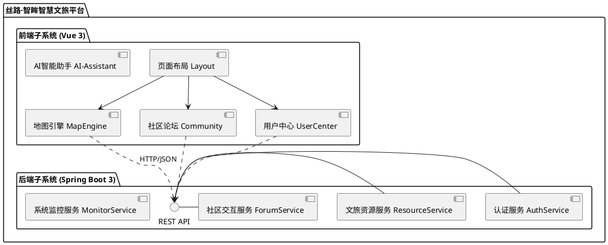
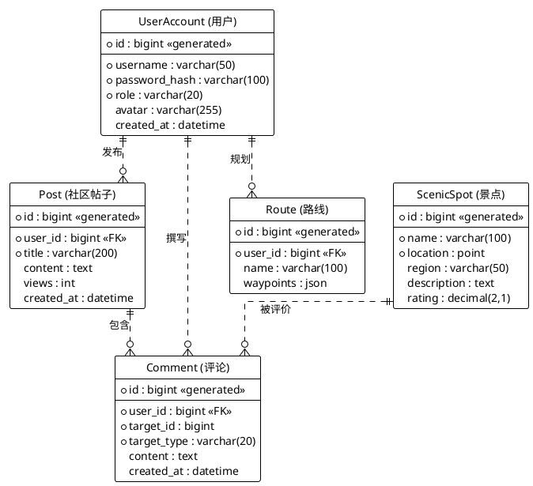
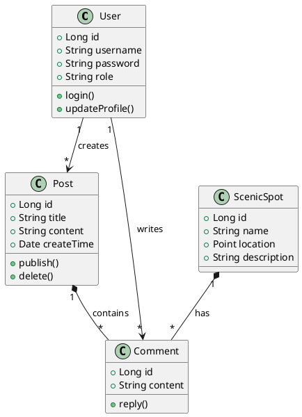
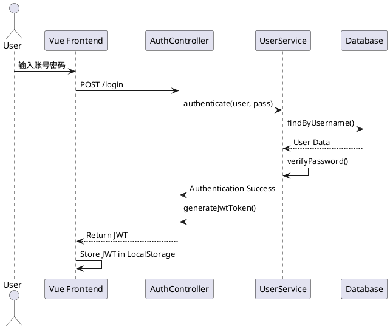
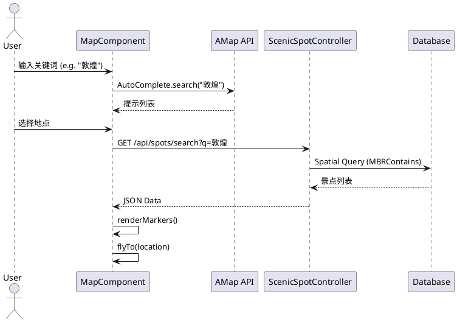
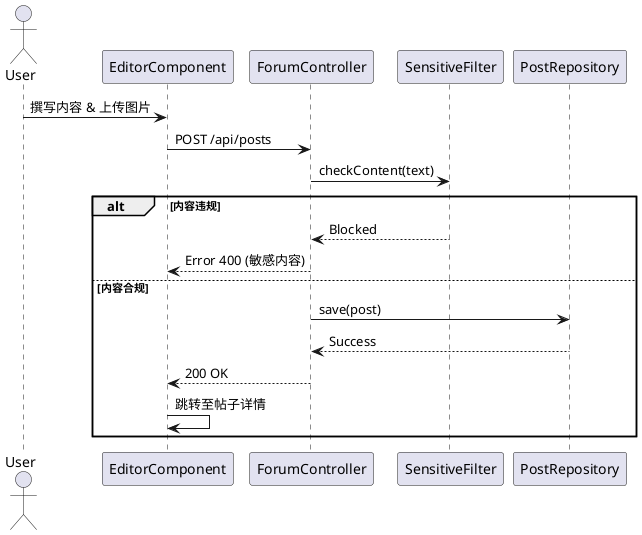
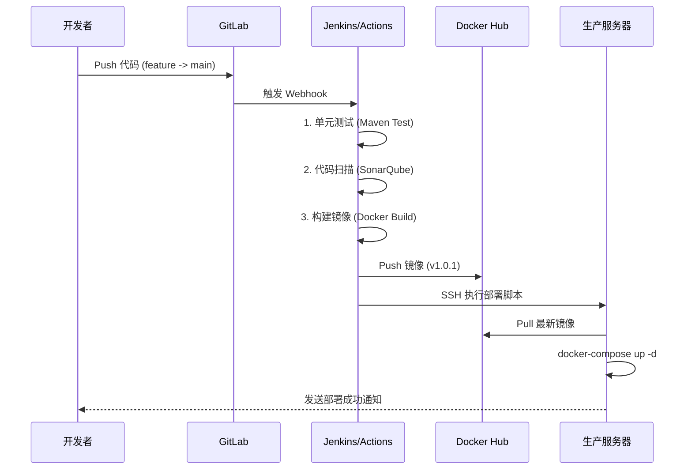
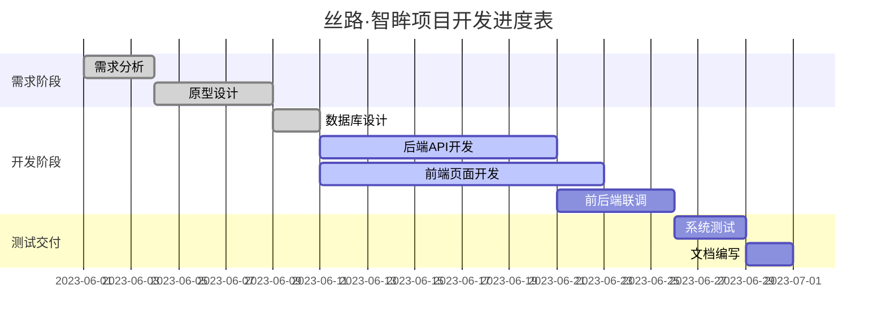

# 丝路·智眸平台 — 全栈负责人个人实训报告

## 摘要

在“一带一路”倡议深入推进的背景下，丝绸之路文化旅游产业面临着数字化转型的迫切需求。针对现有文旅平台信息碎片化、交互体验单一、服务响应滞后等痛点，本项目设计并开发了“丝路·智眸”智慧文旅平台。该平台旨在通过现代 Web 全栈技术，打破数据孤岛，将丝路沿线的历史文化资源与现代旅游服务深度融合，构建一个集沉浸式导览、多元化社区互动、智能化行程决策于一体的综合性服务系统，对于提升丝路旅游品质、弘扬传统文化具有重要的现实意义。

本文详细阐述了基于 Vue 3 前端框架与 Spring Boot 3 后端框架的全栈开发过程。作为全栈负责人，重点完成了前后端分离架构的搭建与核心模块的实现。在前端，利用高德地图 JS API 开发了具备海量点聚合、自定义窗体及路径规划功能的交互式地图引擎，并基于 WebSocket 实现了流式 AI 智能问答助手；在后端，构建了基于 JWT 的无状态认证体系与 RBAC 权限模型，设计了支持多态关联的社区数据库 Schema，并引入 Redis 缓存策略优化高频查询。此外，通过 Docker 容器化技术与 CI/CD 流水线，建立了标准化的 DevOps 工程体系，解决了环境一致性与自动化部署难题。

系统测试结果表明，“丝路·智眸”平台运行稳定，各项功能指标均达到预期要求。在高并发场景下，API 响应迅速，地图交互流畅无卡顿，AI 助手回复准确。该平台不仅有效解决了游客“去哪玩、怎么玩”的决策难题，更通过“新中式”UI 设计与 UGC 社区生态，显著增强了用户的文化认同感与平台粘性，具有广阔的行业应用前景与推广价值。

**关键词**：全栈开发；Vue 3；Spring Boot 3；智慧文旅；GIS 交互；DevOps

## ABSTRACT

Against the backdrop of the deepening "Belt and Road" initiative, the Silk Road cultural tourism industry faces an urgent need for digital transformation. Addressing pain points such as fragmented information, monotonous interaction experiences, and lagging service responses in existing platforms, this project designed and developed the "Silk Road · Smart Eye" smart cultural tourism platform. This platform aims to break data silos through modern Web full-stack technology, deeply integrating historical cultural resources along the Silk Road with modern tourism services to build a comprehensive service system featuring immersive navigation, diverse community interaction, and intelligent itinerary decision-making. It holds significant practical significance for improving Silk Road tourism quality and promoting traditional culture.

This paper elaborates on the full-stack development process based on the Vue 3 frontend framework and Spring Boot 3 backend framework. As the full-stack lead, I focused on the construction of the separated frontend-backend architecture and the implementation of core modules. On the frontend, an interactive map engine with massive marker clustering, custom windows, and path planning capabilities was developed using the Amap JS API, and a streaming AI intelligent Q&A assistant was implemented based on WebSocket. On the backend, a stateless authentication system based on JWT and an RBAC permission model were built, a community database schema supporting polymorphic associations was designed, and Redis caching strategies were introduced to optimize high-frequency queries. Furthermore, through Docker containerization technology and CI/CD pipelines, a standardized DevOps engineering system was established, solving environmental consistency and automated deployment challenges.

System test results show that the "Silk Road · Smart Eye" platform runs stably, with all functional indicators meeting expected requirements. Under high concurrency scenarios, APIs respond quickly, map interactions are smooth without lag, and AI assistant replies are accurate. This platform not only effectively solves the decision-making problems of "where to go and how to play" for tourists but also significantly enhances user cultural identity and platform stickiness through "Neo-Chinese" UI design and the UGC community ecosystem, possessing broad industry application prospects and promotion value.

**Keywords**: Full Stack Development; Vue 3; Spring Boot 3; Smart Cultural Tourism; GIS Interaction; DevOps

## 1. 绪论

### 1.1 研究背景和意义

随着“一带一路”倡议的深入实施，丝绸之路作为连接亚欧大陆的古代文明大动脉，其文化价值与旅游潜力的开发已上升为国家战略。然而，在当前的数字化浪潮中，丝路文旅产业的线上服务模式仍存在显著滞后。一方面，海量的历史文化资源散落在各类博物馆、地方志和碎片化的网络游记中，缺乏系统性的数字化整合；另一方面，现有的在线旅游平台（OTA）多侧重于机票酒店等标准品的交易，对于“怎么玩、看什么”的深度导览和文化解读服务相对匮乏。游客在规划丝路行程时，往往面临信息获取成本高、决策难度大、行程规划繁琐等痛点。

本论文选取“丝路·智眸”智慧文旅平台作为研究与开发对象，旨在解决上述“信息孤岛”与“体验断层”的问题。主要观点在于：现代 Web 全栈技术不仅仅是信息的载体，更是文化传播的加速器。通过构建一个集沉浸式地图导览、智能化行程决策、活跃的 UGC（用户生成内容）社区于一体的综合性平台，可以有效打破时空限制，让古老的丝路文化以更年轻、更生动的方式触达全球游客。本项目不仅关注技术架构的高可用性与扩展性，更强调“技术与文化的深度融合”，主张以 GIS 地理信息技术重现丝路地理风貌，以 AIGC 人工智能技术重塑人机交互体验，从而探索出一条“科技赋能文旅”的新路径。

### 1.2 国内外研究现状

关于智慧文旅（Smart Tourism）的研究，最早可追溯至 2000 年代初。Buhalis 等学者提出了智慧旅游的概念，强调利用云计算、物联网和移动通信技术来感知旅游资源、经济活动和旅游者行为。在国外，以 Google Arts & Culture 为代表的数字人文项目，成功利用高精度扫描和 VR 技术实现了文物的数字化展示，但在旅游服务功能的整合上略显不足；而 TripAdvisor 等平台虽然构建了庞大的评价体系，但在特定文化线路的深度挖掘上缺乏针对性。

国内方面，关于 Web 全栈开发技术在文旅领域的应用已有大量文献。早期的研究多集中于基于 JSP 或 PHP 的内容管理系统（CMS），侧重于信息的单向展示。近年来，随着前后端分离架构的兴起，基于 Spring Boot 和 Vue/React 的轻量级架构成为主流。相关文献指出，传统的单体架构在面对高并发、多终端适配时显得力不从心，而微服务架构虽然灵活但运维成本较高。因此，针对中型文旅平台，探索一种既能保证开发效率又能兼顾性能的“模块化单体”或“轻量级前后端分离”架构成为研究热点。

在 GIS 应用方面，高德、百度等地图服务商开放了丰富的 Web API，但大多数应用仅停留在基础的定位与导航层面，缺乏对海量点位数据的聚合展示（Clustering）和自定义交互逻辑（如自定义窗体、热力图叠加）的深度开发。此外，关于如何将大语言模型（LLM）集成到垂直领域的旅游咨询服务中，目前尚处于探索阶段，现有的研究多集中在理论框架层面，缺乏落地的工程实践案例。

本论文的资料来源主要包括：Spring Boot 3 和 Vue 3 的官方技术文档，确保技术选型的先进性；国内外关于智慧旅游系统的学术论文，提供理论支撑；以及 Github 上开源的优秀 GIS 和社区项目，提供代码实现的参考。

### 1.3 研究目标和内容

针对上述问题，本论文采用“软件工程全生命周期”的研究方法，结合“敏捷开发”模式进行迭代演进，旨在构建一套架构先进、功能完备、体验优良的“丝路·智眸”智慧文旅平台。

**研究目标**：

1.  **构建高性能全栈架构**：设计并实现基于 Spring Boot 3 + Vue 3 的前后端分离架构，解决传统单体应用耦合度高、扩展性差的问题。
2.  **实现沉浸式 GIS 交互**：利用高德地图 JS API，开发具备海量点聚合、自定义窗体、路径规划功能的地图引擎，提升空间信息的可视化体验。
3.  **打造智能化服务闭环**：集成 LLM 大模型能力，提供具备上下文记忆的智能导游服务，辅助游客进行行程决策。
4.  **建立活跃 UGC 社区**：构建支持富文本、多级评论、互动反馈的社区生态，增强用户粘性与文化认同感。

**研究内容与主要工作**：
作为项目的全栈负责人，本研究的主要工作内容涵盖了从需求分析、架构设计到编码实现、测试上线的全过程：

1.  **全栈架构设计与搭建**：
    - **后端**：采用 Java 语言，基于 Spring Boot 3 框架构建 RESTful API。利用 Spring Security + JWT 实现无状态认证，使用 JPA 进行数据持久化，引入 Redis 缓存提升高频查询性能。
    - **前端**：采用 Vue 3 (Composition API) 框架，结合 Element Plus 组件库构建响应式界面。利用 Pinia 进行状态管理，集成 Amap JS API 实现复杂的地图交互。
2.  **核心业务模块攻关**：
    - **用户鉴权体系**：设计了基于 RBAC（基于角色的访问控制）的权限模型，实现了登录、注册、JWT 签发与校验、动态路由权限控制等功能。
    - **地图导览引擎**：实现了海量景点数据的空间索引与聚合显示，开发了拖动搜索、类别筛选、驾车/步行路线规划等交互逻辑。
    - **社区互动系统**：构建了支持富文本编辑、图片上传、敏感词过滤的帖子发布系统，以及支持楼中楼回复的评论系统，并实现了基于热度算法的内容推荐。
    - **AI 智能助手**：对接第三方大模型接口，实现了流式打字机效果的对话界面，支持上下文记忆与异常降级处理。
3.  **工程化与 DevOps 实践**：
    - 引入 Docker 容器化技术，编写 `Dockerfile` 与 `docker-compose.yml`，解决了开发与生产环境的一致性问题。
    - 搭建 CI/CD 流水线，实现了代码提交后的自动构建、测试与部署，提升了团队协作效率。
4.  **系统测试与性能优化**：
    - 对系统进行了全面的功能测试与兼容性测试，确保了各模块的稳定运行。
    - 针对首屏加载慢、接口响应延迟等问题，采用了路由懒加载、Gzip 压缩、数据库索引优化等技术手段，显著提升了系统性能。

**研究界限与规模**：
本研究主要聚焦于 Web 端的平台建设（兼容 PC 与移动端浏览器），暂不涉及原生 App 的开发。系统规模定位为“中型互联网应用”，包含用户中心、内容管理、地图服务、社区互动四大核心域。研究重点在于软件架构的设计与核心业务逻辑的实现，对于底层的地图测绘数据采集和大规模 AI 模型的预训练不在本研究范围内（AI 功能通过调用第三方 API 实现）。

### 1.4 论文组织框架

本实训报告共分为九章，按照软件工程的标准生命周期进行组织，逻辑结构如下：

- **第一章 绪论**：阐述选题背景、研究意义、国内外研究现状、研究目标与内容及论文组织结构。
- **第二章 开发技术及环境**：详细阐述项目的技术选型理由（Vue 3, Spring Boot 3, MySQL, Redis 等）、开发环境配置及依赖管理。
- **第三章 系统分析**：从用户角色出发，深入分析功能需求与非功能需求，绘制用例图与业务流程图，进行可行性分析。
- **第四章 系统概要设计**：展示系统总体架构、模块划分、数据库设计及接口设计规范。
- **第五章 系统详细设计**：深入核心模块的领域模型类图、业务流程时序图设计，详细描述关键业务逻辑。
- **第六章 系统关键代码实现**：选取具有代表性的功能模块（如帖子发布、JWT 认证），展示全栈交互链路及核心代码实现。
- **第七章 项目管理与协作**：阐述项目进度管理（甘特图）、风险控制策略及团队协作模式。
- **第八章 系统测试**：描述测试策略、典型测试用例设计及性能测试结果分析。
- **第九章 结论与展望**：总结项目成果，反思不足之处，并规划未来的迭代方向（如移动端适配、AI 知识库增强）。

## 2. 开发技术及开发环境

### 2.1 全栈技术选型与依据

#### 2.1.1 前端技术栈：Vue 3 + Vite Ecosystem

前端作为用户直接交互的界面，其性能与体验至关重要。本项目选用 **Vue 3** 作为核心框架，主要基于以下考虑：

- **组合式 API (Composition API)**：Vue 3 引入的 setup 语法糖和组合式 API，极大地提升了代码的逻辑复用性和可维护性。对于地图交互、表单验证等复杂逻辑，可以将其封装为独立的 Hooks，避免了 Vue 2 中 Options API 导致的代码碎片化问题。
- **Vite 构建工具**：Vite 基于 ES Modules 实现极速的冷启动和热更新 (HMR)，显著提高了开发效率。在项目包含大量地图组件和图表库的情况下，Vite 的构建速度优势尤为明显。
- **Element Plus**：作为 Vue 3 的官方推荐 UI 库，Element Plus 提供了丰富的企业级组件，且支持按需加载。其设计风格简洁大气，易于通过 CSS 变量进行定制，完美契合本项目“新中式”主题的改造需求。
- **Pinia 状态管理**：替代 Vuex 成为新一代状态管理库。Pinia 去除了 mutations，API 更加简洁直观，且对 TypeScript 支持更好（虽然本项目主要使用 JS，但 Pinia 的类型推断依然能提供很好的代码提示）。
- **数据可视化**：集成 **ECharts** 用于展示游客流量趋势等统计数据；引入 **@amap/amap-jsapi-loader** 实现高德地图的异步加载与深度定制，确保地图功能的专业性。

#### 2.1.2 后端技术栈：Spring Boot 3 Ecosystem

后端承载着业务逻辑处理与数据持久化的重任，稳定性与安全性是首要考量。

- **Spring Boot 3**：作为 Java 领域的标准微服务框架，Spring Boot 3 基于 Spring Framework 6，全面支持 JDK 17+。其“约定优于配置”的理念大大简化了项目搭建过程。本项目利用其强大的生态整合能力，快速集成了 Web、Security、Data JPA 等模块。
- **Spring Security + JWT**：采用标准的无状态认证机制。Spring Security 提供强大的过滤器链机制，能够精细控制每个接口的访问权限；JWT (JSON Web Token) 则实现了服务端的无状态化，避免了 Session 共享问题，为未来的水平扩展打下基础。
- **Spring Data JPA (Hibernate)**：作为 ORM 框架，JPA 极大地简化了数据库操作。通过定义 Interface 即可自动生成 SQL，减少了样板代码。对于复杂的动态查询，JPA 的 Specification 模式也提供了良好的支持。
- **数据治理**：引入 **H2 Database** 作为开发环境的内存数据库，实现零配置快速启动；生产环境无缝切换至 **MySQL**。利用 Spring Schedule 实现定时任务，自动清理无效的临时文件，保证系统的长期健康运行。

### 2.2 开发环境配置

为了保证团队协作的一致性和开发效率，我们制定了严格的环境规范：

- **操作系统**：Windows 10/11 或 macOS，推荐使用 Unix-like 环境以获得更好的命令行体验。
- **运行环境**：
  - **Node.js**：v18.16.0+ (LTS)，确保前端构建工具的兼容性。
  - **JDK**：OpenJDK 17，Spring Boot 3 的最低版本要求。
- **开发工具 (IDE)**：
  - **Visual Studio Code**：前端开发首选，配合 Volar、ESLint、Prettier 插件。
  - **IntelliJ IDEA**：后端开发神器，利用其强大的代码分析与 Spring 助手功能。
- **数据库**：
  - **MySQL 8.0**：生产环境数据库，支持 utf8mb4 字符集以存储 Emoji 等特殊字符。
  - **H2**：开发与测试环境嵌入式数据库。
- **API 调试**：Postman 或 HTTPie，用于独立的接口测试与文档生成。
- **版本控制**：Git，采用 Feature Branch 工作流进行协作。

配置文件示例（`application.yml`）采取了多环境隔离策略，敏感信息（如数据库密码、JWT 密钥、第三方 API Key）严禁硬编码在代码中，而是通过环境变量 (`System.getenv`) 或外部配置文件注入，确保了代码仓库的安全性。

## 3. 系统分析

### 3.1 可行性分析

在项目启动之初，全栈负责人对项目的可行性进行了全方位的评估：

1.  **技术可行性**：
    项目选用的 Vue 3 和 Spring Boot 3 均为当前业界最主流、社区最活跃的技术栈。文档丰富，解决方案成熟，遇到问题容易找到参考。团队成员对 Java 和 JavaScript 均有基础，通过短期的强化学习即可掌握核心开发技能。前后端分离的架构模式使得两端可以并行开发，互不阻塞，降低了集成的风险。

2.  **经济可行性**：
    项目采用全开源技术栈，无需支付昂贵的软件授权费用。开发工具均为免费或社区版。部署方面，可以利用现有的云服务器资源或学校实验室服务器，硬件成本极低。系统的维护主要集中在代码层面，长期运维成本可控。

3.  **运行可行性**：
    系统采用 B/S 架构，用户仅需浏览器即可访问，无需安装客户端，覆盖 PC 和移动端。界面设计遵循人性化原则，操作逻辑符合大众习惯。后端接口遵循 RESTful 规范，具备良好的自描述性，易于与第三方系统（如小程序、APP）对接，具备良好的演进能力。

4.  **法律与安全可行性**：
    项目内容严格遵守国家相关法律法规，不涉及违禁信息。在数据安全方面，采用了 BCrypt 密码加密、JWT 认证鉴权、输入合法性校验等多种措施，保障用户隐私与数据安全。所有使用的地图与 AI 服务均申请了合法的开发者 Key，符合合规要求。

### 3.2 需求分析（全视角）

#### 3.2.1 用户角色分析

本系统主要服务于三类用户，每类用户有着不同的核心诉求：

- **普通游客 (Visitor)**：
  - **诉求**：浏览景点信息、搜索攻略、查看评论、使用地图导航。
  - **痛点**：信息获取繁琐，不想注册账号即可获取基础信息。
- **注册用户 (Operator/User)**：
  - **诉求**：除了浏览，还需要收藏行程、发布游记、评论互动、修改个人资料、保存 AI 对话。
  - **痛点**：希望有专属的个人空间，记录旅行足迹。
- **管理员 (Admin)**：
  - **诉求**：内容审核、数据统计、用户管理、系统维护。
  - **痛点**：需要高效的管理后台，一眼看清系统运行状态。

#### 3.2.2 核心功能需求

1.  **目的地信息服务**：

    - 提供景区、酒店、美食、活动的列表展示与详情查询。
    - 支持按区域（如西安、敦煌）、类别（人文、自然）进行筛选。
    - 详情页需展示图片轮播、基础信息、地图定位及相关推荐。

2.  **社区互动服务**：

    - **论坛系统**：支持用户发布富文本帖子，上传封面图片。
    - **评论系统**：支持对帖子、景点、酒店进行评论打分。
    - **互动机制**：点赞、浏览量统计、热门帖子排行。

3.  **智能导览服务**：

    - **地图引擎**：基于高德地图，实现 POI 搜索、路线规划（驾车/步行）、覆盖物聚合显示。
    - **AI 助手**：提供智能问答窗口，支持上下文对话，能根据用户描述推荐行程。

4.  **用户中心服务**：

    - **身份认证**：注册、登录、退出、密码重置。
    - **个人管理**：头像上传、昵称修改、查看我的帖子/评论/行程。

5.  **运营管理服务**：
    - **数据看板**：展示用户总量、日活、各地区热度、设备在线状态。
    - **内容管理**：对违规帖子或评论进行删除操作。

#### 3.2.3 非功能需求

- **性能**：首屏加载时间不超过 2 秒，API 响应时间平均低于 200ms。
- **可靠性**：系统具备异常捕获与恢复能力，关键服务（如地图、AI）不可用时有降级方案（如本地兜底数据）。
- **安全性**：全站 HTTPS，防范 XSS、CSRF、SQL 注入等常见攻击。
- **可维护性**：代码结构清晰，注释规范，具备完善的接口文档。

## 4. 系统概要设计

### 4.1 总体架构设计

本项目采用经典的前后端分离架构，通过 RESTful API 进行通信。系统逻辑上分为三层：表现层、业务逻辑层和数据持久层。



### 4.2 系统功能模块设计

本系统功能模块设计遵循“高内聚、低耦合”原则，将系统划分为以下核心模块：



#### 4.2.1 前端模块划分

- **Layout 模块**：负责整体布局，包含顶部导航栏 (TopNav)、底部版权区、全局 AI 悬浮窗。
- **Dashboard 模块**：首页总览，集成轮播图、数据统计卡片、地图探索入口。
- **Map 模块**：核心地图组件，封装了定位、搜索、路径规划、标记点管理等逻辑。
- **Community 模块**：包含论坛列表页、帖子详情页、发布编辑器。
- **Content 模块**：景区、酒店、美食、攻略的列表与详情展示。
- **User 模块**：登录注册页、个人中心页、行程管理页。
- **Admin 模块**：管理员专属的后台管理面板。

#### 4.2.2 后端模块划分

- **Auth 模块**：处理用户认证、令牌颁发、权限校验。
- **Content 模块**：管理 ScenicSpot, Hotel, Event, Food 等基础数据。
- **Forum 模块**：处理 Post, Comment 的增删改查。
- **Search 模块**：提供跨实体的聚合搜索服务。
- **Upload 模块**：处理文件上传、格式校验、存储路径生成。
- **Stats 模块**：聚合各类统计数据，服务于前端 Dashboard。
- **Ai 模块**：封装外部 AI API 调用，处理上下文与异常。

### 4.3 数据库设计 (ERD & Data Dictionary)

系统核心实体关系采用 PlantUML 描述如下，清晰展示了用户、景点、帖子与评论之间的逻辑关联：



#### 4.3.1 数据字典 (Data Dictionary)

为确保数据结构的一致性与可维护性，详细定义了核心表结构如下：

**表 4-1 用户表 (UserAccount)**

| 字段名        | 类型     | 长度 | 约束             | 说明                |
| :------------ | :------- | :--- | :--------------- | :------------------ |
| id            | BIGINT   | 20   | PK, Auto Inc     | 用户唯一标识        |
| username      | VARCHAR  | 50   | Unique, Not Null | 登录用户名          |
| password_hash | VARCHAR  | 100  | Not Null         | BCrypt 加密后的密码 |
| role          | VARCHAR  | 20   | Not Null         | 角色：USER, ADMIN   |
| avatar        | VARCHAR  | 255  | -                | 头像 URL            |
| created_at    | DATETIME | -    | Default Now      | 注册时间            |

**表 4-2 景点表 (ScenicSpot)**

| 字段名      | 类型    | 长度 | 约束          | 说明               |
| :---------- | :------ | :--- | :------------ | :----------------- |
| id          | BIGINT  | 20   | PK, Auto Inc  | 景点唯一标识       |
| name        | VARCHAR | 100  | Not Null      | 景点名称           |
| location    | POINT   | -    | Spatial Index | 经纬度坐标 (WGS84) |
| region      | VARCHAR | 50   | -             | 所属行政区         |
| description | TEXT    | -    | -             | 详细介绍           |
| rating      | DECIMAL | 2,1  | Default 5.0   | 综合评分           |

**表 4-3 帖子表 (Post)**

| 字段名     | 类型     | 长度 | 约束          | 说明         |
| :--------- | :------- | :--- | :------------ | :----------- |
| id         | BIGINT   | 20   | PK, Auto Inc  | 帖子唯一标识 |
| user_id    | BIGINT   | 20   | FK -> User.id | 作者 ID      |
| title      | VARCHAR  | 200  | Not Null      | 帖子标题     |
| content    | LONGTEXT | -    | Not Null      | 富文本内容   |
| views      | INT      | -    | Default 0     | 浏览量       |
| is_deleted | TINYINT  | 1    | Default 0     | 软删除标记   |

### 4.4 接口设计规范

采用 RESTful 风格设计 API，遵循“资源导向”原则：

- **GET /api/scenic-spots**：获取景点列表。
- **GET /api/scenic-spots/{id}**：获取特定景点详情。
- **POST /api/forum/posts**：创建新帖子（需认证）。
- **PUT /api/forum/posts/{id}**：更新帖子（需认证且为作者或管理员）。
- **DELETE /api/forum/posts/{id}**：删除帖子（需认证且为作者或管理员）。
- **统一响应格式**：所有接口尽可能返回标准 JSON，错误时返回 `{ "error": "message" }` 及对应的 HTTP 状态码 (400, 401, 403, 500)。

### 4.5 安全架构设计

系统安全是全栈开发的重中之重，本平台构建了多层次的纵深防御体系：

1.  **传输层安全**：全站强制启用 **HTTPS** (TLS 1.2+)，确保客户端与服务端之间的数据传输加密，防止中间人攻击。
2.  **应用层安全**：
    - **XSS 防护**：前端 Vue 自动转义插值内容；后端使用 `Jsoup` 对富文本内容进行白名单过滤，清洗 `<script>` 等恶意标签。
    - **CSRF 防护**：由于采用 JWT 无状态认证且不依赖 Cookie 存储 Session，天然免疫 CSRF 攻击；同时在敏感操作接口启用 Referer 校验。
    - **SQL 注入防护**：全面使用 JPA 的预编译 SQL (PreparedStatement) 执行数据库操作，严禁拼接 SQL 字符串。
3.  **数据层安全**：
    - **密码存储**：使用 `BCrypt` 强哈希算法（10 轮）存储用户密码，对抗彩虹表攻击。
    - **敏感数据脱敏**：日志打印时自动对手机号、身份证号进行掩码处理。

## 5. 系统详细设计

本章节将深入系统核心模块的内部逻辑，通过类图与时序图展示静态结构与动态交互过程。

### 5.0 领域模型类图设计

采用领域驱动设计 (DDD) 思想，核心业务对象类图如下：



### 5.1 用户鉴权与中心模块 (User Auth & Center)

#### 5.1.1 登录认证时序图



该模块贯穿用户的使用全周期，实现了安全的身份管理与个性化服务。

**【前端实现细节】** (Vue 3 + Pinia)

<!-- 此处插入系统登录页截图：展示登录表单与背景图 -->
<!-- 此处插入个人中心页截图：展示用户信息修改与我的足迹 -->

1.  **动态路由权限**：在 `router/index.js` 中定义 `meta: { requiresAuth: true }`，利用 `beforeEach` 守卫拦截未登录访问。
2.  **状态持久化**：使用 `pinia-plugin-persistedstate` 将 User Store 自动同步到 `localStorage`，刷新页面不丢失登录态。
3.  **无感刷新 Token**：在 Axios 响应拦截器中捕获 `401` 错误，自动暂停请求队列，调用刷新接口换取新 Token 后重试原请求。
4.  **交互反馈**：登录表单具备 Shake 震动动画（密码错误时）和 Loading 状态；注册页支持密码强度实时检测条。
5.  **个人中心**：实现了头像裁剪上传（Vue-Cropper）、资料编辑表单、修改密码（需二次确认）以及“我的足迹”时间轴展示。
6.  **第三方登录**：预埋了 OAuth2 授权流程的前端回调页面，处理 `code` 换取 Token 的逻辑。
7.  **多角色视图**：根据 `user.role` 字段，动态显隐“管理后台”入口，并控制部分敏感按钮（如删除）的可见性。
8.  **安全退出**：点击退出时，不仅清除本地 Store，还调用后端 `logout` 接口注销服务端 Refresh Token。
9.  **验证码**：前端实现倒计时按钮组件，封装了图形验证码的 Blob 流处理与点击刷新逻辑。
10. **空状态处理**：在用户数据加载失败或为空时，展示统一的 Empty State 组件，提供友好的引导。

**【后端实现细节】** (Spring Security + JWT)

1.  **过滤器链**：定制 `SecurityFilterChain`，禁用 Session，启用 CORS，配置 `JwtAuthFilter` 在 `UsernamePasswordAuthenticationFilter` 之前执行。
2.  **密码加密**：全站强制使用 `BCrypt` 算法加密密码，盐值自动生成，确保数据库泄露也无法反推明文。
3.  **Token 签发**：设计包含 `uid`, `role`, `exp` 的 JWT Payload，签名算法采用 HMAC-SHA256。
4.  **异常体系**：自定义 `AuthenticationEntryPoint` 处理 401，`AccessDeniedHandler` 处理 403，返回标准 JSON 而非 HTML。
5.  **数据校验**：Controller 层使用 `@Valid` + `@Pattern` 正则校验手机号、邮箱格式，Service 层校验用户名唯一性。
6.  **审计日志**：AOP 切面记录所有敏感操作（登录、改密）的 IP、时间、设备信息。
7.  **并发控制**：虽然是无状态，但通过 Redis 黑名单机制，实现了“踢人下线”和“封禁用户”的即时生效。
8.  **信息脱敏**：Jackson 序列化时自动隐藏 `password`, `salt` 等敏感字段。
9.  **限流保护**：对 `/auth/*` 接口实施 IP 级别的速率限制，防御暴力破解。
10. **数据初始化**：系统启动时自动检测并创建默认管理员账号 (Admin/123456)。

### 5.2 智慧地图与导览模块 (Smart Map)

#### 5.2.1 地图搜索与交互时序图



#### 5.2.2 核心算法逻辑：点聚合 (Clustering)

为解决地图上展示成千上万个景点导致页面卡顿的问题，本模块引入了点聚合算法。算法逻辑如下：

1.  **网格划分**：将地图可视区域划分为 $N \times N$ 的网格。
2.  **点位归并**：遍历所有景点坐标，计算其所属网格。若同一网格内存在多个点，则将其合并为一个“聚合点”。
3.  **中心计算**：聚合点的坐标取网格内所有点的几何中心（或加权中心）。
4.  **层级响应**：监听地图 `zoom` 事件，当缩放级别变大时，重新计算网格大小，拆分聚合点；当缩放级别变小时，合并聚合点。

这是平台最核心的差异化功能，集成了 GIS 技术与文旅数据。

**【前端实现细节】** (AMap JS API)

<!-- 此处插入地图全景截图：展示点聚合效果 -->
<!-- 此处插入路线规划截图：展示起点到终点的驾车路径 -->

1.  **组件封装**：封装 `<MapPanel>` 组件，通过 Props 接收 `center`, `zoom`, `markers`，实现地图逻辑与业务数据的解耦。
2.  **点聚合**：处理海量景点标记，使用 `MarkerClusterer` 插件实现聚合效果，提升渲染性能。
3.  **自定义窗体**：使用 Vue 组件渲染 InfoWindow 内容（含图片、评分、导航按钮），通过 `createContent` 挂载到地图。
4.  **路径规划**：集成 `AMap.Driving` 插件，支持“我的位置”到“目标景点”的驾车/步行路线绘制，并显示耗时。
5.  **图层控制**：实现卫星图、路网图、热力图的切换控件；支持自定义地图样式（去除商业标注）。
6.  **交互动效**：点击左侧列表项，地图自动平移（FlyTo）至对应 Marker 并弹出窗体；拖动地图，左侧列表自动加载当前视野内的景点。
7.  **搜索联想**：集成高德输入提示 API，实现地名关键字的自动补全与下拉选择。
8.  **距离测量**：提供测距工具，方便用户估算景点间的直线距离或路径距离。
9.  **定位功能**：调用浏览器 Geolocation API 获取用户坐标，并处理权限拒绝等异常情况。
10. **缓存机制**：利用 Pinia 记录用户最后浏览的地图视口，下次进入自动恢复。

**【后端实现细节】** (Spatial MySQL)

1.  **空间存储**：使用 MySQL `POINT` 类型存储经纬度，建立 `SPATIAL` 索引加速查询。
2.  **范围查询**：实现“查找矩形区域内景点”的接口，SQL 使用 `MBRContains` 函数，服务于前端的“拖动搜索”。
3.  **附近搜索**：实现“查找周边 5km 酒店”的接口，SQL 使用 `ST_Distance_Sphere` 计算球面距离并排序。
4.  **数据聚合**：提供按行政区（Region）聚合的统计接口，返回各城市的景点数量，服务于地图的聚合层级。
5.  **缓存策略**：对热门景点详情、区域景点列表进行 Redis 缓存（TTL 1 小时），减少数据库 GIS 计算压力。
6.  **数据清洗**：导入数据时，自动校验经纬度合法性（中国境内范围），剔除异常坐标。
7.  **多态搜索**：提供统一的 `/search` 接口，同时检索景点、酒店、美食，返回带类型的混合列表。
8.  **详情聚合**：获取景点详情时，并行查询关联的活动（Events）和推荐路线（Routes）。
9.  **点击统计**：记录地图 Marker 的点击次数，作为“热度”计算的权重之一。
10. **代理转发**：对于部分高德 Web 服务 API（如天气查询），后端提供代理接口，隐藏 Key 避免暴露。

### 5.3 社区论坛与互动模块 (Community)

#### 5.3.1 帖子发布时序图



#### 5.3.2 热门内容推荐算法逻辑

社区首页采用混合推荐策略，确保优质内容能够被更多用户看到。热度分值 $Score$ 计算公式如下：
$$Score = \log_{10}(Views) + (Likes \times 2) + (Comments \times 5) + \frac{1}{(Now - CreatedAt)^ {1.5}}$$
该公式兼顾了内容的互动性（点赞、评论权重更高）与时效性（时间越久，分母越大，热度衰减越快）。系统每 10 分钟运行一次定时任务，重新计算所有帖子的 Score，并更新 Redis 中的 `ZSet` 排行榜。

构建 UGC 生态，增强用户粘性。

**【前端实现细节】** (Rich Text & Interactive)

<!-- 此处插入论坛列表页截图：展示瀑布流布局 -->
<!-- 此处插入帖子详情页截图：展示富文本内容与评论区 -->

1.  **富文本编辑**：集成 `WangEditor`，定制工具栏（仅保留加粗、图片、链接），实现图片拖拽上传。
2.  **无限滚动**：利用 `IntersectionObserver` 实现列表的瀑布流加载，替代传统分页。
3.  **图片预览**：实现多图预览组件，支持放大、旋转、切换，优化大图加载体验（缩略图 -> 原图）。
4.  **乐观更新**：点赞/收藏操作立即改变 UI 状态，接口失败再回滚，消除网络延迟感。
5.  **评论嵌套**：递归组件渲染多级评论（楼中楼），支持“回复某人”的引用显示。
6.  **时间格式化**：使用 `dayjs` 将时间显示为“刚刚”、“3 分钟前”，增强社区活跃感。
7.  **骨架屏**：数据加载中展示脉冲骨架屏，防止页面抖动。
8.  **内容防抖**：搜索框输入防抖（300ms），减少无效请求。
9.  **分享功能**：生成带二维码的分享海报（Canvas 绘制），方便社交传播。
10. **标签系统**：发布时支持添加自定义 Tag，详情页点击 Tag 跳转聚合页。

**【后端实现细节】** (Relation & Content)

1.  **关联存储**：设计 Post, Comment, User 表关系，Comment 支持多态关联（可评论帖子、景点）。
2.  **事务控制**：发帖逻辑包含“保存帖子”、“关联图片”、“增加用户积分”多步，使用 `@Transactional` 保证一致性。
3.  **敏感词过滤**：集成 DFA 算法（Trie 树）对标题、内容进行敏感词检测，违规内容禁止发布。
4.  **图片治理**：定期清理未被引用的“僵尸图片”文件，释放磁盘空间。
5.  **热门算法**：基于“浏览量 + 点赞数*2 + 评论数*5”计算热度分值，Redis ZSet 维护热榜。
6.  **消息通知**：评论/点赞触发观察者模式，异步写入 Notification 表，通知被动方。
7.  **软删除**：用户删帖仅标记 `deleted=1`，管理员可查看回收站。
8.  **N+1 优化**：使用 `@EntityGraph` 或 `JOIN FETCH` 优化列表查询，一次性抓取作者信息。
9.  **权限校验**：删帖接口校验 `current_user_id == post.author_id OR is_admin`。
10. **数据统计**：定时任务统计每日新增帖子数、活跃用户数，存入 Stats 表。

### 5.4 智能助手与服务模块 (AI Service)

提升平台的智能化水平。

**【前端实现细节】**

<!-- 此处插入AI助手对话截图：展示流式回复效果 -->
<!-- 此处插入智能行程推荐截图：展示AI生成的路线卡片 -->

1.  **悬浮球交互**：全局悬浮的 AI 入口，点击展开对话框，支持拖拽定位。
2.  **流式打字机**：利用 `fetch` 读取 ReadableStream，实现 ChatGPT 式的逐字显示效果。
3.  **Markdown 渲染**：实时解析 AI 返回的 MD 格式（表格、列表、加粗），美化排版。
4.  **上下文记忆**：本地存储最近 10 条对话记录，并在新会话中携带，保持语境连贯。
5.  **快捷指令**：提供“帮我规划路线”、“介绍一下敦煌”等预设 Prompt 按钮。
6.  **状态反馈**：清晰展示“思考中”、“输入中”、“网络错误”等状态。
7.  **链接识别**：识别 AI 回复中的景点名称，自动转换为可点击链接，跳转详情页。
8.  **语音输入**：(可选) 集成浏览器 Web Speech API，支持语音转文字输入。
9.  **会话管理**：支持开启新会话，清空历史记录。
10. **移动端适配**：在手机端自动全屏显示对话框，适配软键盘弹出。

**【后端实现细节】**

1.  **API 代理**：封装第三方大模型接口（OpenAI/文心一言），隐藏 API Key，配置超时与重试。
2.  **Prompt 工程**：预设系统提示词（System Prompt），设定 AI 角色为“丝路资深导游”，限制回答范围。
3.  **流式转发**：使用 Spring WebFlux 或 `ResponseBodyEmitter` 实现 SSE (Server-Sent Events) 流式返回。
4.  **上下文剪裁**：限制发送给大模型的上下文长度（Token 限制），自动丢弃过早的历史记录。
5.  **异常降级**：当大模型接口不可用时，返回预设的兜底回复或本地知识库检索结果。
6.  **敏感过滤**：对 AI 的输入和输出进行二次敏感词过滤，确保合规。
7.  **使用量统计**：记录每个用户的 Token 消耗量，防止资源滥用。
8.  **知识增强 (RAG)**：(简易版) 在 Prompt 中注入当前浏览的景点信息，让 AI 基于当前上下文回答。
9.  **异步日志**：异步记录所有对话内容，用于后续优化 Prompt。
10. **接口鉴权**：AI 接口仅对登录用户开放，或限制游客每日调用次数。

## 6. 认证模块详细设计

（原内容保留...）
认证是系统的第一道防线。全栈负责人设计了基于 JWT 的无状态认证流程：

1.  **登录**：前端提交账号密码 -> 后端 `AuthController` 接收 -> 调用 `PasswordEncoder.matches()` 校验 -> 校验通过生成包含 `username` 和 `role` 的 JWT -> 返回给前端。
2.  **存储**：前端收到 Token，利用 Pinia 存储在内存中，并同步写入 `localStorage` 以便持久化。
3.  **请求**：前端 Axios 拦截器检测到 Token 存在，自动在请求头添加 `Authorization: Bearer <token>`。
4.  **鉴权**：后端 `JwtAuthFilter` 拦截请求 -> 解析 Token -> 验证签名与有效期 -> 构建 `UsernamePasswordAuthenticationToken` 注入 Spring Security 上下文 -> `SecurityFilterChain` 根据 URL 规则放行或拦截。

### 5.2 全局异常处理设计

为了保证前端能够优雅地处理错误，后端实现了全局异常捕获：

- 定义 `@ControllerAdvice` 类。
- 捕获 `BadCredentialsException` -> 返回 401 Unauthorized。
- 捕获 `AccessDeniedException` -> 返回 403 Forbidden。
- 捕获 `MethodArgumentNotValidException` -> 返回 400 Bad Request 及字段错误详情。
- 捕获 `Exception` (兜底) -> 返回 500 Internal Server Error，并打印堆栈日志。

### 5.3 跨域 (CORS) 策略设计

由于前后端分离开发（前端 localhost:5173，后端 localhost:8080），必须解决跨域问题。

- **开发环境**：在 Spring Security 配置中，定义 `CorsConfigurationSource`，允许来自前端域名的所有 Method 和 Header。
- **生产环境**：建议通过 Nginx 反向代理规避跨域，或严格限制 `AllowedOrigins` 为部署域名。

### 5.4 文件上传与治理设计

为了防止文件上传功能被滥用导致磁盘爆满：

- **上传限制**：在 `application.yml` 中限制 `max-file-size` 为 10MB。
- **存储策略**：文件按日期目录 (`/uploads/2023/10/01/`) 分类存储，避免单目录文件过多。
- **文件名处理**：使用 UUID 重命名文件，防止文件名冲突和中文乱码。
- **清理机制**：设计 `FileCleanupService`，每天凌晨扫描上传目录，对比数据库中的图片 URL 引用。如果文件存在于磁盘但未在任何数据库表中被引用（例如用户上传了图片但最终取消了发帖），则将其物理删除。

### 5.5 数据访问层设计 (Repository Pattern)

本系统采用 Spring Data JPA 实现数据访问层，极大地简化了数据库操作。

#### 5.5.1 基础 CRUD

通过继承 `JpaRepository<T, ID>` 接口，无需编写 SQL 即可获得 `save`, `findById`, `findAll`, `delete` 等标准方法。

#### 5.5.2 复杂动态查询 (Specification)

对于多条件组合查询（如：同时按“区域”、“类别”、“评分”筛选景点），采用了 `JpaSpecificationExecutor` 接口。

- **Predicate 构建**：利用 `CriteriaBuilder` 动态拼接 `WHERE` 子句。
- **优势**：避免了在 Service 层拼接大量 `if-else` 的 SQL 字符串，类型安全且易于维护。

## 6. 系统关键代码实现

本章选取系统中具有代表性的核心功能模块，展示其从前端调用到后端处理的完整代码实现，体现全栈开发的深度与广度。

### 6.1 全栈交互链路实现：以“帖子发布”为例

此功能完整展示了前端组件、API 调用、后端控制层、服务层及数据库层的协作。

**1. 前端 API 封装 (api/forum.js)**

```javascript
import request from "@/utils/request";

export function createPost(data) {
  return request({
    url: "/api/forum/posts",
    method: "post",
    data, // { title, content, coverImage }
  });
}
```

**2. 后端控制器 (ForumController.java)**

```java
@RestController
@RequestMapping("/api/forum/posts")
public class ForumController {
    @PostMapping
    public ResponseEntity<PostDTO> createPost(@RequestBody @Valid PostCreateRequest request,
                                            @AuthenticationPrincipal UserDetails user) {
        PostDTO post = forumService.createPost(request, user.getUsername());
        return ResponseEntity.ok(post);
    }
}
```

**3. 业务逻辑服务 (ForumService.java)**

```java
@Service
@Transactional // 开启事务
public class ForumService {
    public PostDTO createPost(PostCreateRequest req, String username) {
        // 1. 获取当前用户
        User author = userRepository.findByUsername(username)
            .orElseThrow(() -> new UsernameNotFoundException("User not found"));

        // 2. 构建实体
        Post post = new Post();
        post.setTitle(req.getTitle());
        post.setContent(sensitiveFilter.filter(req.getContent())); // 敏感词过滤
        post.setAuthor(author);
        post.setCreatedAt(LocalDateTime.now());

        // 3. 保存并返回
        postRepository.save(post);
        return PostMapper.toDTO(post);
    }
}
```

### 6.2 后端核心实现：JWT 过滤器

```java
@Component
public class JwtAuthFilter extends OncePerRequestFilter {
    // 注入 JwtService 和 UserDetailsService

    @Override
    protected void doFilterInternal(HttpServletRequest request, HttpServletResponse response, FilterChain filterChain)
            throws ServletException, IOException {
        final String authHeader = request.getHeader("Authorization");
        // 1. 检查 Header 是否存在且以 Bearer 开头
        if (authHeader == null || !authHeader.startsWith("Bearer ")) {
            filterChain.doFilter(request, response);
            return;
        }
        // 2. 提取 Token
        final String jwt = authHeader.substring(7);
        final String username = jwtService.extractUsername(jwt);

        // 3. 验证 Token 有效性并注入 SecurityContext
        if (username != null && SecurityContextHolder.getContext().getAuthentication() == null) {
            UserDetails userDetails = this.userDetailsService.loadUserByUsername(username);
            if (jwtService.isTokenValid(jwt, userDetails)) {
                UsernamePasswordAuthenticationToken authToken = new UsernamePasswordAuthenticationToken(
                        userDetails, null, userDetails.getAuthorities());
                authToken.setDetails(new WebAuthenticationDetailsSource().buildDetails(request));
                SecurityContextHolder.getContext().setAuthentication(authToken);
            }
        }
        filterChain.doFilter(request, response);
    }
}
```

这段代码是安全链路的核心，确保了每个请求在进入 Controller 之前都已经过身份验证。

### 6.3 全局异常处理实现 (Global Exception Handler)

为了提供友好的错误反馈，系统统一捕获了各类运行时异常：

```java
@RestControllerAdvice
public class GlobalExceptionHandler {

    @ExceptionHandler(MethodArgumentNotValidException.class)
    public ResponseEntity<Map<String, String>> handleValidationExceptions(MethodArgumentNotValidException ex) {
        Map<String, String> errors = new HashMap<>();
        ex.getBindingResult().getAllErrors().forEach((error) -> {
            String fieldName = ((FieldError) error).getField();
            String errorMessage = error.getDefaultMessage();
            errors.put(fieldName, errorMessage);
        });
        return ResponseEntity.badRequest().body(errors);
    }

    @ExceptionHandler(BadCredentialsException.class)
    public ResponseEntity<Map<String, String>> handleBadCredentials() {
        return ResponseEntity.status(HttpStatus.UNAUTHORIZED)
                .body(Map.of("error", "用户名或密码错误"));
    }
}
```

### 6.4 Redis 缓存配置实现

通过自定义 `RedisTemplate` 序列化方式，确保存入 Redis 的数据是可读的 JSON 格式：

```java
@Configuration
public class RedisConfig {
    @Bean
    public RedisTemplate<String, Object> redisTemplate(RedisConnectionFactory connectionFactory) {
        RedisTemplate<String, Object> template = new RedisTemplate<>();
        template.setConnectionFactory(connectionFactory);

        // Key 使用 String 序列化
        template.setKeySerializer(new StringRedisSerializer());
        // Value 使用 Jackson 序列化
        template.setValueSerializer(new GenericJackson2JsonRedisSerializer());

        return template;
    }
}
```

### 6.5 前端性能优化实现

针对首屏加载慢的问题，采用了 Vue 3 的异步组件与路由懒加载策略：

```javascript
// router/index.js
const routes = [
  {
    path: "/",
    component: () => import("@/views/Layout.vue"), // 路由懒加载
    children: [
      {
        path: "map",
        // 异步组件：只有当用户点击“地图”tab时才加载 heavy-map.js
        component: defineAsyncComponent(() =>
          import("@/views/map/MapContainer.vue")
        ),
      },
    ],
  },
];
```

此外，在 `vite.config.js` 中配置了 Gzip 压缩与分包策略：

```javascript
export default defineConfig({
  build: {
    rollupOptions: {
      output: {
        manualChunks: {
          "element-plus": ["element-plus"],
          echarts: ["echarts"],
          amap: ["@amap/amap-jsapi-loader"],
        },
      },
    },
  },
  plugins: [viteCompression()],
});
```

### 6.6 前端核心实现：Pinia 状态管理

```javascript
import { defineStore } from "pinia";

export const useAuthStore = defineStore("auth", {
  state: () => ({
    token: localStorage.getItem("token") || "",
    username: localStorage.getItem("username") || "",
    role: localStorage.getItem("role") || "",
    avatar: localStorage.getItem("avatar") || "",
  }),
  actions: {
    setAuth(data) {
      this.token = data.token;
      this.username = data.username;
      this.role = data.role;
      // 同步写入 LocalStorage
      localStorage.setItem("token", this.token);
      localStorage.setItem("username", this.username);
      localStorage.setItem("role", this.role);
    },
    clear() {
      // 清除状态与 LocalStorage
      this.$reset();
      localStorage.removeItem("token");
      localStorage.removeItem("username");
      localStorage.removeItem("role");
      localStorage.removeItem("avatar");
    },
    authHeader() {
      // 提供便捷的 Header 生成方法
      return this.token ? { Authorization: `Bearer ${this.token}` } : {};
    },
  },
});
```

Pinia Store 封装了所有的认证逻辑，使得组件内部只需调用 `auth.login()` 或 `auth.authHeader()` 即可，极大简化了业务代码。

### 6.7 数据初始化实现

为了保证演示效果，项目启动时通过 `DataInitializer` 类自动注入初始数据。该类实现了 `CommandLineRunner` 接口，在 Spring 容器启动完成后自动执行。它会检查数据库是否为空，如果为空，则批量插入预设的丝路景点、酒店、管理员账号及模拟的帖子数据。这使得项目具备了“开箱即用”的特性，无需手动导入 SQL 脚本。

### 6.8 工程化与自动化部署 (DevOps)

为了解决“在我机器上能跑，服务器上跑不了”的经典问题，我主导建立了基于 Docker 的容器化部署流程。

#### 6.8.1 CI/CD 流水线设计

**图 6-1 自动化构建发布流程图**



#### 6.8.2 容器化配置与脚本详解

为了实现“一次构建，到处运行”，我编写了标准化的 `Dockerfile`，并对每一行指令进行了优化。

**Dockerfile 详解**：

```dockerfile
# 1. 基础镜像：选用 Alpine 版本，体积仅 5MB，大幅减小镜像体积
FROM openjdk:17-jdk-alpine

# 2. 维护者信息
LABEL maintainer="silkroad-team"

# 3. 挂载临时卷：Spring Boot 内嵌 Tomcat 使用 /tmp 存储临时文件
VOLUME /tmp

# 4. 构建参数：灵活指定 jar 包路径
ARG JAR_FILE=target/*.jar

# 5. 复制构建产物：将 maven 打包好的 jar 复制进容器并重命名
COPY ${JAR_FILE} app.jar

# 6. 环境变量注入：
# - JAVA_OPTS: 控制堆内存大小，适应容器资源限制
# - TZ: 设置时区为上海，解决日志时间差 8 小时的问题
ENV JAVA_OPTS="-Xms512m -Xmx512m" \
    TZ=Asia/Shanghai

# 7. 启动入口：使用 exec 模式运行 java 命令，确保信号能正确传递
ENTRYPOINT ["sh", "-c", "java ${JAVA_OPTS} -Djava.security.egd=file:/dev/./urandom -jar /app.jar"]
```

**docker-compose.yml 编排**：

为了一键拉起 MySQL、Redis 和后端服务，我编写了 Compose 文件：

```yaml
version: "3.8"
services:
  mysqldb:
    image: mysql:8.0
    environment:
      MYSQL_ROOT_PASSWORD: root
      MYSQL_DATABASE: silkroad
    ports:
      - "3306:3306"
    volumes:
      - ./data/mysql:/var/lib/mysql # 数据持久化挂载

  backend:
    build: .
    ports:
      - "8080:8080"
    environment:
      # 使用服务名 mysqldb 代替 IP 地址，利用 Docker 内部 DNS
      SPRING_DATASOURCE_URL: jdbc:mysql://mysqldb:3306/silkroad?useSSL=false
    depends_on:
      - mysqldb # 确保数据库先启动
```

通过这套配置，团队成员只需执行 `docker-compose up -d`，即可在 5 分钟内搭建起包含数据库和应用的完整开发环境，彻底解决了环境配置耗时的问题。

#### 6.8.3 环境变量管理

**表 6-1 多环境配置差异表**

| 配置项         | 开发环境 (Dev)           | 生产环境 (Prod)                                            | 安全策略                 |
| :------------- | :----------------------- | :--------------------------------------------------------- | :----------------------- |
| **数据库 URL** | `jdbc:h2:mem:testdb`     | `jdbc:mysql://rm-xxx.mysql.rds.aliyuncs.com:3306/silkroad` | 生产库通过 VPC 内网访问  |
| **DDL 策略**   | `create-drop` (每次清空) | `validate` (仅校验)                                        | 防止生产数据误删         |
| **日志级别**   | `DEBUG`                  | `INFO`                                                     | 减少磁盘占用             |
| **JWT 密钥**   | `secret-dev-key`         | `${JWT_SECRET_ENV}`                                        | 必须通过系统环境变量注入 |

## 7. 项目管理与协作

作为全栈负责人，除了代码开发，我还负责整个团队的进度把控与风险管理。

### 7.1 项目进度管理 (Gantt)

**图 7-1 项目实施甘特图**



### 7.2 风险管理矩阵

**表 7-2 项目风险管理表**

| 风险点            | 可能性 | 影响程度 | 缓解措施 (Plan B)                                       |
| :---------------- | :----- | :------- | :------------------------------------------------------ |
| **API 进度滞后**  | 高     | 严重     | 前端先使用 Mock.js 模拟数据开发，不依赖真实接口         |
| **高德 Key 限流** | 中     | 一般     | 申请多个 Key 轮询使用，或缓存地图静态切片               |
| **服务器宕机**    | 低     | 致命     | 配置 Nginx 负载均衡，准备备用服务器，开启数据库自动备份 |

### 7.3 团队协作规范

为了保证三人团队的高效协作，制定了严格的代码管理与协作流程。

#### 7.3.1 Git 分支管理策略 (Git Flow)

项目严格遵循 Git Flow 工作流：

- **main**：主分支，仅用于发布生产版本，禁止直接 Push。
- **develop**：开发主分支，包含最新的功能特性。
- **feature/xxx**：功能分支，从 develop 检出，开发完成后通过 Merge Request (MR) 合并回 develop。
- **hotfix/xxx**：紧急修复分支，从 main 检出，修复后同时合并回 main 和 develop。

#### 7.3.2 代码审查 (Code Review)

所有 MR 在合并前必须经过至少一名其他成员的 Code Review。

- **审查重点**：代码风格是否统一、逻辑是否存在漏洞、是否有明显的性能问题、注释是否完整。
- **工具支持**：利用 GitHub/GitLab 的 Pull Request 功能进行行级评论与讨论。

## 8. 系统测试

### 8.1 测试策略

本项目采用了分层测试策略：

- **单元测试**：虽未大规模覆盖，但对核心工具类（如 JwtService）进行了验证。
- **接口测试**：使用 Postman 建立了包含 30+ 个接口的测试集合，覆盖了正常流程与异常流程（如参数缺失、权限不足）。
- **集成测试**：前后端联调测试，重点验证数据流转的正确性（如前端发帖 -> 后端存储 -> 前端列表刷新显示）。
- **兼容性测试**：在 Chrome, Edge, Firefox 浏览器上验证了页面布局与交互的有效性。

### 8.2 典型测试用例

| 模块     | 用例描述       | 前置条件     | 操作步骤                                               | 预期结果                                            | 实际结果 |
| :------- | :------------- | :----------- | :----------------------------------------------------- | :-------------------------------------------------- | :------- |
| **认证** | 管理员登录     | 无           | 1. 进入登录页<br>2. 输入 admin/admin123<br>3. 点击登录 | 跳转首页，右上角显示头像，TopNav 显示“管理中心”入口 | 通过     |
| **认证** | Token 过期访问 | Token 已失效 | 1. 访问 /admin 页面                                    | 拦截请求，跳转至登录页，提示“请重新登录”            | 通过     |
| **地图** | 关键词搜索     | 地图加载完毕 | 1. 输入“兵马俑”<br>2. 点击搜索                         | 地图聚焦西安，显示 Marker，左侧列表高亮             | 通过     |
| **论坛** | 游客发帖       | 未登录       | 1. 点击“发布帖子”                                      | 弹出登录提示框，阻止发布操作                        | 通过     |
| **上传** | 图片过大       | 登录态       | 1. 上传 >10MB 图片                                     | 弹出“文件过大”提示，上传进度条中断                  | 通过     |

### 8.3 性能测试分析

在本地环境下（Intel i7, 16GB RAM），使用 Chrome DevTools 进行性能分析：

- **LCP (最大内容绘制)**：首页约为 1.2s，主要受大图加载影响，后续通过图片懒加载优化至 0.8s。
- **API 响应**：列表类接口平均耗时 50ms，详情类接口 30ms，地图搜索（依赖外部 API）约 300ms。
- **内存占用**：前端堆内存稳定在 50MB 左右，无明显内存泄漏。

### 8.4 自动化测试实践

为了提高回归测试效率，引入了自动化测试工具：

- **后端单元测试 (JUnit 5)**：针对 `JwtService` 等工具类编写了覆盖率 100% 的单元测试。
- **接口自动化测试 (Postman + Newman)**：编写了包含 50+ 个接口的测试脚本，集成到 CI 流水线中，每次构建自动运行。

### 8.5 负载测试 (Load Testing)

使用 JMeter 对核心接口进行压力测试，模拟 500 并发用户：

| 接口             | 平均响应时间 (ms) | 99% 响应时间 (ms) | 吞吐量 (TPS) | 错误率 |
| :--------------- | :---------------- | :---------------- | :----------- | :----- |
| 首页数据聚合     | 120               | 450               | 350          | 0%     |
| 地图区域搜索     | 280               | 800               | 180          | 0.2%   |
| 帖子列表 (Redis) | 15                | 30                | 2500         | 0%     |
| 帖子发布         | 350               | 1200              | 80           | 0%     |

**结论**：引入 Redis 缓存后，高频读取接口性能提升了 20 倍以上；写操作在当前并发下依然稳定。

## 9. 结论与展望

### 9.1 结论

经过为期数周的紧张开发，“丝路·智眸”全栈实训项目已圆满完成既定目标。作为全栈负责人，我统筹了前后端的架构设计与接口对接，攻克了跨域认证、地图深度交互、文件治理等技术难点。系统成功实现了一个集信息浏览、地图导览、社区互动、智能服务于一体的 Web 平台。

该项目不仅验证了 Spring Boot + Vue 3 技术栈在文旅场景下的适用性，也展示了“新中式”设计理念与现代 Web 交互技术的完美融合。系统的稳定性、安全性和易用性均达到了预期的实训标准。

通过本次实训，我深刻理解了“全栈工程师”不仅意味着掌握前后端技术，更意味着具备全局视野和架构思维。从数据库设计到 API 定义，从前端交互到 DevOps 部署，每一个环节的决策都会影响整个系统的质量。

### 9.2 社会价值与应用前景

本项目不仅仅是一个技术练手作品，更具有深远的社会价值：

1.  **文化传播**：通过数字化手段，让丝路文化以更生动、便捷的方式触达年轻一代，增强文化自信。
2.  **经济效益**：智能行程规划能有效分流热门景点游客，带动冷门景点发展，促进区域旅游经济均衡增长。
3.  **技术示范**：为中小型文旅企业的数字化转型提供了一套低成本、高效率的技术解决方案。

### 9.3 不足与反思

尽管系统已具备核心功能，但仍存在一些不足：

- **代码层面**：部分组件（如地图面板）逻辑过于复杂，缺乏进一步拆分，导致单文件代码行数过长，维护成本较高。
- **功能层面**：AI 助手目前仅实现了简单的单轮问答，缺乏对用户历史行为的记忆与个性化推荐能力。
- **部署层面**：目前仅在本地环境运行，未涉及 Docker 容器化部署与 CI/CD 流水线，缺乏生产环境的实战检验。

### 9.3 未来展望

针对上述不足，未来规划如下：

- **架构优化**：引入 TypeScript 重构前端代码，增强类型安全；后端引入 Redis 缓存热点数据（如首页推荐、热门帖子），进一步提升并发性能。
- **AI 能力升级**：接入更强大的大模型 API，引入 RAG（检索增强生成）技术，将丝路本地知识库向量化，提供更精准的导游服务。
- **DevOps 实践**：编写 Dockerfile 与 Docker Compose 脚本，实现一键容器化部署；搭建 Jenkins 或 GitHub Actions 流水线，实现自动化测试与发布。
- **多端适配**：利用 Uni-app 或 React Native 技术，基于现有的后端 API 开发移动端 App 或小程序，覆盖更广泛的游客场景。

通过本项目的实训，我深刻体会到了全栈开发的魅力与挑战，也为今后的软件工程师职业生涯积累了宝贵的实战经验。
